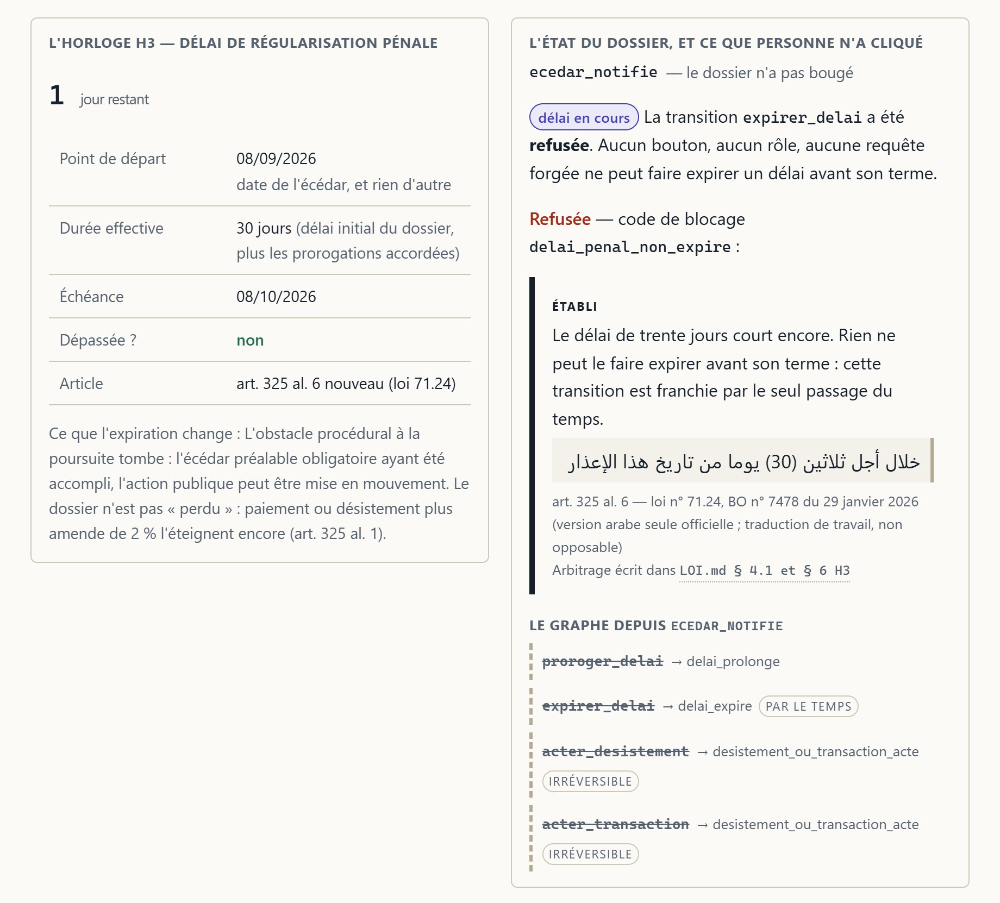
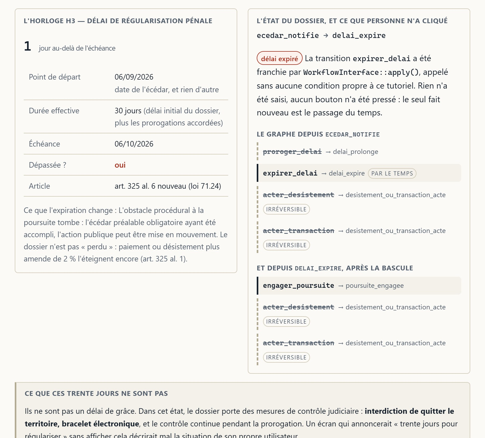

<!-- Le logo d'en-tête est `brand/logo.svg` et non `logo-complet.svg`, pour une
     raison de rendu et non de goût : GitHub sert un SVG de README dans une
     balise `img`, qui l'isole de la page. `logo-complet.svg` porte du texte en
     `currentColor` et une pile de polices — dans cet isolement, `currentColor`
     retombe au noir et le nom disparaît sur le thème sombre. `logo.svg` est
     fait de trois rectangles de couleur fixe : il rend pareil partout, et son
     plancher de 16 px laisse de la marge ici. Voir `brand/README.md`. -->
<p align="center">
  
</p>

<h1 align="center">Tasswiya</h1>

<p align="center">
  Les délais de régularisation du chèque sans provision au Maroc,<br>
  sous la loi n° 71.24 — et le droit lu avant d'être codé.
</p>

> ### ⚠ Ceci n'est pas un conseil juridique.
>
> Tasswiya est une démonstration technique. Les données qu'il manipule sont
> **fictives**, aucun montant affiché n'est opposable, et aucune date calculée
> ici ne vaut devant une juridiction. Pour une situation réelle, il faut un
> avocat. L'avertissement est sur chacun des cinq écrans du produit, et il doit
> l'être aussi partout où ce projet est présenté.
>
> **Seule la version arabe de la loi fait foi.** Il n'existe aucune traduction
> française officielle de la loi n° 71.24 : la série française du Bulletin
> officiel passe du n° 7474 au n° 7480. Tout énoncé français de ce dépôt est une
> **traduction de travail**, non opposable.

`tasswiya` (تسوية) veut dire *régularisation*.

---

## Le problème

Quand un chèque revient impayé au Maroc, ce n'est pas un délai qui démarre mais
**cinq**, et ils ne partent pas du même jour : l'un part de la date écrite sur le
chèque, un autre de la lettre de la banque, un autre d'une convocation au
commissariat qui arrivera peut-être des mois plus tard.

Créanciers, débiteurs et avocats les comptent sur un carnet. Une date ratée
renvoie tout le monde au pénal — exactement ce que la réforme de janvier 2026
voulait éviter.

Tasswiya tient ces cinq horloges, dit laquelle court, et **refuse une action
quand une règle de droit s'y oppose, en nommant la règle, son article et son
degré de certitude.**

---

## Ce qu'on voit

### Les cinq horloges, et pourquoi un seul champ de date ferait mentir le produit


La colonne **« Part de »** est l'argument de tout le projet : elle nomme cinq
faits datés **différents** — date d'émission, injonction bancaire, écédar,
échéance d'une autre horloge, incident de paiement — et la colonne **« Reste »**
les écarte franchement. Le dossier choisi est le seul du jeu fictif où les cinq
courent ensemble avec cet écart.

### Le moment qui se voit : le temps passe, et une transition s'ouvre

C'est le couple d'images à regarder. Même écran, même dossier, même cadre au
pixel. **Rien n'a été saisi, aucun bouton n'a été pressé** : le seul fait nouveau
entre les deux est le passage du temps.

| `/tutoriel?jours=29` | `/tutoriel?jours=31` |
|---|---|
|  |  |
| H3 : **1 jour restant** — dépassée ? **non**. Point de départ : la date de l'écédar, **et rien d'autre**. Les quatre transitions sortantes sont **rayées**, et le refus de `expirer_delai` porte sa règle, son verbatim arabe, l'art. 325 al. 6 et son renvoi à `LOI.md`. | H3 : **1 jour au-delà de l'échéance** — dépassée ? **oui**. Le dossier est passé seul de `ecedar_notifie` à `delai_expire`. Une seule transition s'est ouverte : `expirer_delai`, marquée **par le temps** — et c'est **celle que personne ne peut déclencher**. Un second graphe apparaît, depuis `delai_expire`, qui montre ce que l'expiration ouvre : `engager_poursuite`. |

Ce que les deux images montrent est **compté**, pas décrit :

```sh
for j in 29 30 31; do
  h=$(curl -s "http://localhost:8001/tutoriel?jours=$j")
  printf 'jours=%-3s sortantes=%s  barrées=%s  ouvertes=%s\n' "$j" \
    "$(printf '%s' "$h" | grep -o 'tut-transition__nom'   | wc -l)" \
    "$(printf '%s' "$h" | grep -o 'tut-transition--barree' | wc -l)" \
    "$(printf '%s' "$h" | grep -o '<li class="tut-transition">' | wc -l)"
done
```

```
jours=29  sortantes=4  barrées=4  ouvertes=0
jours=30  sortantes=4  barrées=4  ouvertes=0
jours=31  sortantes=7  barrées=5  ouvertes=2
```

Trente jours ne suffisent pas non plus, et ce n'est pas un détail :
`Horloge::estDepassee()` exige un dépassement **strict**, donc le jour de
l'échéance le délai court encore. À trente et un jours, le graphe de départ
compte toujours quatre sorties mais une seule est ouverte ; les trois sorties
supplémentaires et la cinquième barrée appartiennent au second graphe, celui qui
n'existait pas avant. Le test qui épingle ce comportement est
`tests/Controller/TutorielTest.php::testLeDossierNeBasculeQuAuTrenteEtUniemeJour`.

### Les quatre degrés de certitude, et l'épreuve du niveau de gris


`/charte/planche.html` § 3. **Aucun écran du produit ne met les quatre
ensemble** — c'est la planche qui les range côte à côte pour qu'on puisse les
comparer. La colonne de droite est passée en niveaux de gris : ce n'est pas
l'illustration, c'est l'épreuve.

### La règle de droit, et le choix de logiciel qui n'est pas la même chose


Dans l'ordre où le produit les affiche, et **jamais l'inverse** : d'abord ce que
la loi ouvre, ensuite ce que ce logiciel restreint. Le second encadré porte sa
vérification par absence — un `grep -c` qui rend `0`, reproductible, et dont le
détail est plus bas.

> **À ne pas recopier.** Les nombres de ces captures — « 3 jours restants »,
> « 75 j », « 1738 j » — sortent du jeu de données **fictif** et du décalage de
> l'horloge de démonstration. Ils changent au prochain chargement des fixtures.
> Les seuls nombres stables que ces images épinglent sont les quatre transitions
> sortantes et la seule qui s'ouvre.
>
> **Et une mention d'honnêteté sur les captures elles-mêmes :** le service
> tourne en `APP_ENV=dev` (`.env`), et le WebProfiler de Symfony injecte sa barre
> en `position: fixed` dans chaque réponse HTML. Le script de capture la retire
> du DOM avant de mesurer, et s'arrête si elle survit. C'est de
> l'instrumentation de développement, absente d'une image déployée ; **rien
> d'autre n'est masqué.** Sur l'image « après », le cadre commun aux deux temps
> déborde d'environ 108 px : l'encart « Ce que ces trente jours ne sont pas » y
> tient sur trois lignes, dont la dernière est coupée. C'est le prix du cadre
> identique au pixel, et il est assumé.

---

## Ce que le droit a démenti

Le texte officiel a été lu **avant** d'écrire la première ligne de code. Il a
**démenti trois affirmations du cahier des charges du projet**, et chaque
démenti a changé le modèle de données.

`LOI.md` (68 Ko) donne chaque règle avec sa source et son degré de certitude.
Les pièces primaires sont dans `docs/sources/`, pour que les commandes
ci-dessous soient rejouables sur un clone.

### 1. La prorogation n'est pas limitée à une fois — et la loi ne la limite pas du tout

Le brief du projet, plusieurs cabinets et l'essentiel de la presse écrivent
« 30 jours, prolongeables **une seule fois** ». **Cette règle n'existe pas.**

L'article 325 alinéa 8 nouveau ouvre la prorogation
« **لمدة مماثلة أو أكثر، بعد موافقة المستفيد** » — *pour une durée égale ou
supérieure, après accord du bénéficiaire* — sans plafonner **ni la durée, ni le
nombre**.

La vérification est une **absence**, et une absence se vérifie :

```sh
grep -c "مرة واحدة"      docs/sources/loi_71-24_extrait_BO7478.txt       # 0
grep -c "مرة واحدة"      docs/sources/circulaire_parquet_2-2026_OCR.txt  # 0
grep -c "مماثلة أو أكثر" docs/sources/loi_71-24_extrait_BO7478.txt       # 1
```

Trois raisons cumulatives de croire le Bulletin officiel contre la presse sont
exposées au § 4.1 de `LOI.md` : les mots ne sont pas dans le texte ; une seconde
source **officielle** (l'Observatoire national de la criminalité) confirme
indépendamment « une durée équivalente ou plus » ; et la circulaire du parquet
elle-même ne dit pas « une seule fois » — or une circulaire ne peut pas réduire
ce que la loi ouvre.

**Conséquence dans le code.** La garde reste — c'est le moment filmé — mais elle
**change de nature**. Elle s'appelle `quotaProlongationsEpuise()` et non
`prolongationDejaJoueeUneFois()`, son degré est **CHOIX_PRODUIT**, elle est
paramétrable, et partout où elle bloque l'écran dit que c'est **ce logiciel** qui
bloque. L'info-bulle que le brief prévoyait — « déjà prolongé une fois, loi
71-24 » — aurait attribué à la loi une règle que la loi ne porte pas.

> **Ce dépôt n'écrit donc jamais que la loi limite le nombre de prorogations.**
> C'est testé, pas seulement promis :
> `tests/Integration/CertitudesAffichablesTest.php::aucuneRegleNAttribueALaLoiUneLimiteDuNombreDeProrogations`.

### 2. Les « 2 % contre 25 % auparavant » ne comparaient pas ce qu'on croyait

Le plan initial en tirait un barème daté — 25 % avant le 29 janvier 2026, 2 %
après. Les deux textes primaires disent autre chose :

- **ancien art. 316** : les 25 % étaient le **plancher de l'amende pénale
  prononcée par le tribunal après condamnation** ;
- **ancien art. 325** : si la provision était constituée dans les vingt jours de
  la **présentation**, le tribunal **pouvait** réduire ou écarter la peine de
  **prison**. Rien de plus.

Donc avant le 29 janvier 2026, **il n'existait aucun mécanisme d'extinction de
l'action publique contre paiement d'un pourcentage**. Les 25 % et les 2 % ne sont
pas deux valeurs d'une même grandeur, mais **deux objets juridiques différents**.
Un barème daté aurait modélisé une grandeur qui n'a jamais existé — et le
régime antérieur s'exprime donc comme un **régime**, pas comme un taux.

Dans la même famille d'erreurs, écartée au § 4.3 : le triplet « taux 2 %,
minimum 500 DH, plafond 50 000 DH » publié par un site de cabinet fusionne
**trois amendes** qui n'ont ni la même assiette, ni le même débiteur, ni le même
effet. Le modèle en porte donc trois, et jamais un champ `tauxAmende`.

### 3. Les trente jours ne courent pas du rejet du chèque

Ils courent de l'**écédar** (إعذار) — une mise en demeure qui prend la forme
d'un **interrogatoire par un officier de police judiciaire**, sur instruction du
parquet, **postérieur à la plainte** de plusieurs semaines ou mois (art. 325
al. 6 nouveau).

Ni la présentation, ni le rejet, ni la plainte, ni l'injonction bancaire.
L'explication probable de l'erreur, qui est la plus coûteuse du dossier :
**l'ancien** article 325 faisait bien courir vingt jours depuis la présentation.
Toute source qui parle de vingt jours, ou d'un délai courant du rejet, décrit
l'état antérieur.

**Conséquence dans le code.** L'horloge pénale (H3) démarre sur l'événement
`EcedarNotifie`, et cet événement **exige son procès-verbal d'audition** pour
exister. Un dossier sans écédar n'a pas de délai pénal — et
`joursRestantsSurLeDelaiPenal()` rend `null`, jamais zéro : zéro voudrait dire
« il expire aujourd'hui », ce qui serait faux et grave pour qui compte sur ce
chiffre.

---

## Comment ça marche

### Deux machines à états, et pourquoi `state_machine` et non `workflow`

Un `workflow` Symfony autorise plusieurs jetons simultanés : un sujet peut être
dans plusieurs places à la fois. Une `state_machine` n'en autorise qu'un.

Un dossier occupe une **position procédurale**, et une seule. Il ne peut pas être
à la fois « délai en cours » et « poursuite engagée », puisque l'article 325
al. 6 fait justement de l'écédar et de son délai une condition **préalable** de
la poursuite. Autoriser les deux places ensemble rendrait exprimable un état que
le droit exclut — et une machine qui peut représenter l'impossible ne protège
plus de rien.

```sh
grep -c '^    case ' src/Enum/EtatDossier.php                   # 14 états
grep -c '^    case ' src/Enum/TransitionDossier.php             # 14 transitions
grep -c '^    case ' src/Enum/EtatInterdictionBancaire.php      #  3 états
grep -c '^    case ' src/Enum/TransitionInterdictionBancaire.php #  2 transitions
```

Ces énumérations ne sont pas une copie décorative du YAML : un test les compare
place par place et transition par transition, et **échoue** si l'un des deux
dérive (`tests/Workflow/GrapheDuDossierTest.php`, méthodes
`lesPlacesDuYamlEtLEnumerationDesEtatsCoincident` et
`lesTransitionsDuYamlEtLEnumerationCoincident`).

### L'extrait de `config/packages/workflow.yaml` qu'il faut lire

Le fichier fait 703 lignes, dont l'essentiel est du commentaire : chaque garde y
porte **son article et son degré**, pour que qui le relit dans six mois puisse
répondre à deux questions sur n'importe quelle ligne — d'où vient cette règle, et
à quel point est-elle sûre. Les deux transitions qui comptent, commentaires
retirés :

```yaml
                proroger_delai:
                    from: [ecedar_notifie, delai_prolonge]
                    to: delai_prolonge
                    guard: >
                        subject.decisionParquetEnregistree()
                        and subject.accordBeneficiaireEnregistre()
                        and subject.beneficiaireDisponible()
                        and subject.dureeProlongationDemandeeAuMoinsEgaleAuDelaiInitial()
                        and not subject.quotaProlongationsEpuise()
                        and is_granted('DOSSIER_ACCORDER_PROLONGATION', subject)

                expirer_delai:
                    from: [ecedar_notifie, delai_prolonge]
                    to: delai_expire
```

Six conditions sur la première, et elles ne sont **pas de même nature** :

| Condition | Nature | Degré |
|---|---|---|
| `decisionParquetEnregistree()` | règle de droit — la décision appartient au ministère public, « يمكن للنيابة العامة » | établi |
| `accordBeneficiaireEnregistre()` | règle de droit — condition cumulative et **asymétrique** : le parquet peut refuser même si le bénéficiaire accepte | établi |
| `beneficiaireDisponible()` | **angle mort du texte** : la loi exige l'accord sans dire quoi faire si le bénéficiaire est injoignable, décédé ou pluriel. Ce logiciel **bloque et le dit**, au lieu de présumer un accord | incertain → **alerte** |
| `dureeProlongationDemandeeAuMoinsEgaleAuDelaiInitial()` | règle de droit — « égale ou supérieure » est un **plancher**, pas un plafond : la garde refuse une durée trop **courte**, jamais une durée trop longue | établi |
| `quotaProlongationsEpuise()` | **choix de ce logiciel**, pas du droit (voir plus haut) | choix produit |
| `is_granted(...)` | règle de droit portée par un Voter : l'accord du bénéficiaire est une condition **de droit**, pas une case à cocher | établi |

Et **`expirer_delai` n'a aucune garde dans le YAML, exprès**, pour deux raisons
qui sont toutes les deux des pièges connus :

1. **la seule condition est temporelle, et le langage d'expressions n'a pas accès
   à l'horloge.** La garde vit donc entière dans
   `src/Workflow/EcouteurDeGardesTemporelles.php`, qui reçoit son horloge par
   injection ;
2. **cette transition est poussée par le Scheduler, donc hors requête.** Une
   garde `is_granted()` y lèverait une exception faute de jeton de sécurité. Un
   test l'interdit structurellement
   (`GrapheDuDossierTest::lesTransitionsTemporellesNOntAucuneGardeIsGranted`).

La garde temporelle, en entier :

```php
#[AsEventListener(event: 'workflow.dossier_penal.guard.expirer_delai')]
public function surExpirationDuDelai(GuardEvent $evenement): void
{
    $dossier = $evenement->getSubject();
    \assert($dossier instanceof Dossier);

    if (!$this->horloges->delaiPenalExpire($dossier)) {
        $this->bloquer($evenement, CatalogueDesBlocages::DELAI_PENAL_NON_EXPIRE);
    }
}
```

`bloquer()` n'écrit pas un message : il va chercher dans
`src/Workflow/CatalogueDesBlocages.php` une règle qui porte son article, son
degré, son verbatim arabe et son renvoi à `LOI.md`. C'est ce qui fait qu'un
bouton n'est jamais grisé en silence.

```sh
grep -c '^    public const string ' src/Workflow/CatalogueDesBlocages.php   # 21 règles
```

### Les cinq horloges

Les durées et les articles de ce tableau viennent du texte, pas d'une mesure :
chacun est sourcé au § 2 de `LOI.md`, avec son degré.

| | Horloge | Part de | Durée | Si elle expire | Article |
|---|---|---|---|---|---|
| **H1** | présentation au paiement | la date d'émission **portée sur le chèque** | 20 j au Maroc, 60 j depuis l'étranger | les recours cambiaires tombent — mais le tiré doit **quand même** payer | 268, non modifié |
| **H2** | exonération de la pénalité bancaire | la date de l'**injonction bancaire** | 3 mois | deux amendes deviennent dues, pas une | 314 nouveau + 307 al. 3 |
| **H3** | **régularisation pénale** | la date de l'**écédar** | 30 j | l'obstacle procédural à la poursuite tombe | 325 al. 6 nouveau |
| **H4** | régularisation bancaire | l'**échéance de H1** — le départ de cette horloge est l'arrivée d'une autre | 2 ans | la faculté d'émettre n'est plus recouvrable par cette voie | 313 nouveau |
| **H5** | interdiction bancaire d'émettre | la date de l'**incident de paiement** | 5 ans | l'interdiction tombe, **sans** la purge des effets que seule la régularisation produit | 312 et 313 nouveaux |

Un champ unique `dateLimiteRegularisation` dans l'entité `Dossier` est
**interdit** par le dossier de règles, et c'est l'interdiction la plus explicite
qu'il contienne. H4 suffit à le montrer : son point de départ est l'**échéance**
d'une autre horloge, ce qu'un champ unique ne peut pas exprimer.

Les horloges sont des **objets-valeurs calculés, jamais persistés**. La base
stocke les **faits datés** — la date de l'écédar, celle de l'injonction — et les
échéances se recalculent à chaque affichage. Persister une échéance la figerait
sous les règles de calcul du jour où elle a été écrite, et une correction de
l'hypothèse de calcul ne repasserait jamais sur les dossiers anciens.

Le test `tests/Workflow/MachineDuDossierTest.php::lesCinqHorlogesSontDistinctes`
épingle qu'elles ne se confondent pas.

### `ClockInterface` : une seule porte d'entrée du présent

Il n'y a **aucun `new DateTime()` dans tout `src/`**, et aucune lecture
détournée de l'horloge système :

```sh
grep -rnE 'new \\?DateTime' src/ | wc -l                                      # 0
grep -rnE '\b(time|date|strtotime|mktime)\s*\(' src/ --include='*.php' \
  | grep -vE 'modify|format'                                                  # (vide)
grep -rn -- '->now()' src/ | wc -l                                            # 5
```

Cinq appels, dans quatre fichiers, et un seul dans le domaine :
`CalculateurDHorloges` demande l'instant à l'horloge injectée et le ramène à
minuit. Les autres sont l'horloge de démonstration elle-même et deux écrans qui
affichent l'écart.

Ce qui en découle, et qui est le vrai bénéfice :

- **on peut tester un délai de trente jours sans attendre un mois.** Le bloc
  `when@test` de `config/services.yaml` substitue la `MockClock` de Symfony à
  l'alias de l'horloge de démonstration. L'ordre des alias compte, et il est
  commenté sur place : le dernier gagne, et la suite de tests doit rester
  maîtresse de son temps ;
- **on peut filmer une règle en train de s'appliquer.** `/demonstration` pousse
  le présent, pas les données. Aucune date de dossier n'est antidatée, aucun état
  n'est forcé : le dossier ne vieillit pas, c'est le présent qui avance. La
  différence est tout le sujet — antidater ferait **mentir** le dossier, déplacer
  le présent fait **vieillir** une situation vraie.

Et la bascule qui s'ensuit passe par le **même code qu'en production** :
`src/Workflow/ExpirateurDeDelais.php` demande à la machine à états si
`expirer_delai` est franchissable, et la garde temporelle répond en lisant cette
horloge. La démonstration ne prend donc aucun raccourci que la production
n'aurait pas.

**La preuve est expérimentale, et elle se refait à la main** : charger le jeu
fictif, relever les compteurs, pousser l'horloge de cent jours depuis
`/demonstration`, relever à nouveau. Les cinq colonnes se déplacent toutes
d'exactement −100, parce qu'il n'y a qu'une porte.

```sh
docker compose exec php bin/console tasswiya:charger-les-donnees-de-demonstration
docker compose exec php bin/console tasswiya:verifier-les-ecrans   # relevé initial
# puis, sur http://localhost:8001/demonstration, « avancer de 100 jours »
docker compose exec php bin/console tasswiya:verifier-les-ecrans   # le même relevé, décalé
```

L'avance passe par l'écran et non par la console, et c'est délibéré : le décalage
est protégé par un jeton CSRF, et il n'existe pas de « se placer au 14 mars » qui
permettrait de fabriquer un dossier pour une date choisie. On avance, ou on remet
à zéro.

### Le cinquième rôle de la charte n'a pas de couleur

La charte tient quatre rôles en couleur (indigo `#635bff` pour l'action, l'or
pour la valeur, vert et rouge pour la direction) et un **cinquième porté par le
trait** :

| Degré | Trait | Ce que l'écran écrit |
|---|---|---|
| établi | **plein** | l'article, et la loi n° 71.24 |
| probable | **double** | la source secondaire — « instruction du parquet », « doctrine » — et **jamais** la loi |
| incertain | **tireté** + hachures | « point non tranché — à vérifier », et une **alerte** au lieu d'une conclusion |
| choix produit | **pointillé** + grille de points + retrait | « choix d'implémentation de ce logiciel, pas une règle de droit » |

Pourquoi le trait : **`border-style` est la seule propriété de cette liste qu'un
navigateur imprime toujours.** Les aplats de couleur sautent à l'impression en
économie d'encre, les ombres sautent, les dégradés sautent. Un degré de certitude
qui disparaît quand on imprime la page est un degré de certitude qui n'existe pas
— et c'est exactement sur ce support qu'un dossier juridique circule. La planche
`/charte/planche.html` § 3 passe les quatre en niveaux de gris pour le vérifier.

Qu'une règle non établie ne puisse pas se réclamer de la loi n'est pas une
consigne de rédaction : `RegleAppliquee` **refuse d'exister** dans ce cas — elle
lève à la construction — et les sept tests de
`tests/Integration/CertitudesAffichablesTest.php`
(`grep -c '#\[Test\]'`) parcourent les **deux catalogues en entier**, pour que la
vérification ne dépende pas du chemin d'exécution qui, ce jour-là, construit
telle règle.

---

## Comment lancer

Il n'y a **ni PHP, ni Composer, ni CLI Symfony** sur le poste de développement de
ce projet : **tout passe par Docker**, et la recette ci-dessous est celle qui a
servi à produire les chiffres de cette page.

```sh
git clone <l'adresse de ce dépôt> tasswiya
cd tasswiya
docker compose up -d
```

> `git remote -v` ne rend rien aujourd'hui : ce dépôt est local, et l'adresse à
> mettre à la place de `<l'adresse de ce dépôt>` est celle depuis laquelle vous
> lisez cette page. Le reste des commandes est indépendant de l'endroit où vous
> l'avez cloné — **aucune n'écrit un chemin absolu**, et c'est volontaire : un
> `cd C:/Users/…` dans un README a déjà été payé une fois sur un dépôt voisin.

> **Pour le mettre en ligne** plutôt que de le faire tourner chez vous, la
> recette complète est dans **[`DEPLOIEMENT.md`](DEPLOIEMENT.md)** : Render pour
> l'application, Neon pour la base, **une seule valeur à saisir**, et les
> mesures de l'image de production bridée à 512 Mo. Ce n'est pas le même
> `Dockerfile` que celui du développement, et la différence y est expliquée.

Le **premier** démarrage installe les dépendances dans le conteneur (une à deux
minutes, selon le réseau) parce que `vendor/` vit dans un volume Docker et non
sur le poste ; les suivants sont immédiats. Suivre l'avancement :

```sh
docker compose logs -f php
```

Puis, une fois `composer install` terminé, la base et le jeu fictif :

```sh
docker compose exec php bin/console doctrine:migrations:migrate --no-interaction
docker compose exec php bin/console tasswiya:charger-les-donnees-de-demonstration
```

L'application répond alors sur **<http://localhost:8001>**, et il y a **cinq
écrans** :

| Adresse | Ce qu'on y voit |
|---|---|
| `/` | l'état de la pile — et il rend 200 même base injoignable, parce qu'il mesure « le service écoute-t-il ? » |
| `/dossiers` | la liste, classée par urgence |
| `/dossiers/{reference}` | un dossier : ses cinq horloges, ses règles, ses transitions et leurs refus |
| `/demonstration` | l'horloge que l'on pousse |
| `/tutoriel` | le tutoriel interactif — **aucune sortie n'y est maquettée** |
| `/charte/planche.html` | la planche de charte, qui se mesure elle-même |

Le tutoriel mérite un mot : pas une valeur de cet écran n'est écrite à la main
dans le gabarit. Les échéances sortent du calculateur, les refus de
`buildTransitionBlockerList()`, les articles et les degrés du catalogue, le
graphe de `getDefinition()`, et l'extrait de configuration est **lu sur le
disque** dans `config/packages/workflow.yaml`. Si une règle change, le tutoriel
change ; s'il se trompe, c'est que le moteur se trompe. Il n'écrit rien : aucun
`persist`, aucun `flush`, aucune requête — les dossiers y sont construits en
mémoire à chaque requête et jetés à la fin.

### Les commandes utiles

```sh
docker compose exec php vendor/bin/phpunit
docker compose exec php bin/console tasswiya:verifier-les-ecrans
docker compose exec php bin/console tasswiya:faire-expirer-les-delais
docker compose exec php bin/console workflow:dump dossier_penal
docker compose exec php bin/console lint:container
docker compose exec php bin/console about
```

La base de développement est aussi joignable depuis le poste sur
`127.0.0.1:5434` (utilisateur, mot de passe et base : `tasswiya`).

---

## Les chiffres, et la commande qui les imprime

**Aucun nombre de ce dépôt n'est publié sans la commande qui l'imprime ou le test
qui l'épingle**, et toute proportion dit sur combien de cas elle porte. Les
chiffres du *phénomène* — volumétries de chèques impayés, dossiers classés — ne
sont connus que par reprises de presse : **ils ne figurent nulle part ici.**

### La suite de tests

```sh
docker compose exec php vendor/bin/phpunit
```

```
OK (153 tests, 474 assertions)
```

Ces tests ne vérifient pas seulement que le code tourne. Une bonne partie
vérifie que le **produit ne ment pas** : qu'aucune règle non établie ne se
réclame de la loi, qu'aucun montant vide n'est muet, que chaque horloge nomme son
point de départ, que le diagnostic affiché ne diverge jamais de la machine à
états.

### Le volume du dépôt

```sh
git ls-files | wc -l                                                      # 131
git ls-files | grep -vE '\.(pdf|lock)$' | tr '\n' '\0' \
  | xargs -0 wc -l | tail -1                                              # 37445
```

131 fichiers suivis ; **37 445 lignes** de texte écrit, hors les deux PDF des
sources officielles (62 282 lignes à elles deux, qui ne sont pas du travail de ce
dépôt) et hors `composer.lock`, qui est généré. Dont **9 547 lignes dans `src/`**
et **2 881 dans `tests/`** (`git ls-files src | tr '\n' '\0' | xargs -0 wc -l`).

Deux honnêtetés sur ces deux nombres. Le second **compte cette page**, qui est le
plus gros fichier Markdown du dépôt après `LOI.md` : un README qui se mesure
lui-même doit le dire. Et le premier était 131 au moment où ces lignes ont été
écrites, **avant** que les cinq captures de `docs/captures/` n'entrent dans
l'index ; elles ajoutent 5 fichiers et 1,9 Mo, que la commande comptera au
prochain `git add`. C'est pour cela que la commande est donnée : elle vaut mieux
que le nombre.

### Ce que les écrans affichent

Une commande compte ce que les écrans affichent et rend un verdict avec un code
de sortie. Elle contrôle quatre invariants : qu'une transition impossible a au
moins un motif et qu'une transition possible n'en a aucun ; qu'aucune règle non
établie ne se réclame de la loi ; que tout montant non chiffré porte sa raison ou
sa fourchette ; et que chaque horloge a un point de départ nommé.

```sh
docker compose exec php bin/console tasswiya:verifier-les-ecrans
```

Relevé du 7 octobre 2026, sur le jeu fictif fraîchement chargé — la commande
imprime son présent de référence en première ligne, **et c'est nécessaire** :

```
 Présent de référence : 07/10/2026.

  Dossiers                                           9
  Horloges qui courent, toutes horloges confondues   38
  Dossiers où le délai pénal (H3) ne court pas       4
  Transitions sortantes examinées                    25
  Transitions barrées                                24
  Barrées par une RÈGLE                              12
  Barrées par une HABILITATION seule                 12
  Règles affichées (occurrences)                     74
  … de degré établi                                  62
  … de degré probable                                9
  … de degré incertain                               2
  … de degré choix produit                           1
  Montants proposés                                  52
  … que ce logiciel refuse de chiffrer               23
  Règles au catalogue des blocages                   21
  Règles d'affichage hors blocage                    6
```

**Deux de ces lignes seulement sont stables** : les 21 règles au catalogue et les
6 règles d'affichage hors blocage, qui sont dans le code. Toutes les autres
dépendent du jeu fictif **et de la date** : à mesure que le présent avance, des
horloges cessent de courir et des transitions changent de camp. C'est pour cela
que la commande imprime sa date, et pour cela qu'on ne recopie aucun de ces
nombres ailleurs.

En revanche, **23 montants sur 52 que ce logiciel refuse de chiffrer** n'est pas
un défaut : c'est l'hypothèse H6 du dossier de règles. Quand l'assiette est
indéterminée — le manquant n'est presque jamais chiffré en pratique —
retomber sur le montant du chèque **surestimerait** l'amende. Le produit refuse
donc de chiffrer, **et dit pourquoi**. Un montant vide et muet serait pire qu'un
montant faux : le lecteur le prendrait pour une panne et irait chercher le
chiffre ailleurs.

### La mémoire, et les 512 Mo du déploiement

La contrainte est de tenir dans **512 Mo**. L'image de production a été
construite et mesurée le 7 octobre 2026, contre un PostgreSQL voisin ; la recette
complète est en tête de `render.yaml` :

```sh
docker build -t tasswiya-prod .
docker run -d --name essai --network tasswiya_default -p 8099:8080 \
  --memory 512m -e APP_SECRET=... -e DATABASE_URL=... tasswiya-prod
docker stats --no-stream --format '{{.MemUsage}}' essai   # rien n'a été servi
curl -s -o /dev/null localhost:8099/                      # une seule visite
docker stats --no-stream --format '{{.MemUsage}}' essai   # un ouvrier a travaillé
```

**Il faut deux mesures, pas une, et c'est le détail qui rend le chiffre
reproductible.** Le serveur intégré préfork quatre ouvriers qui ne chargent le
noyau Symfony qu'à leur **première** requête : un conteneur qui n'a encore rien
servi pèse **11,97 Mio**, le même après une seule visite de `/` en pèse
**27,10 Mio**. Sur l'hébergeur, le contrôle de santé le fait répondre tout de
suite, donc c'est la seconde valeur qui décrit le service en ligne.

Après les cinq écrans : **39,47 Mio** sur 512. Et sous 200 requêtes dont 20 en
parallèle, **39,78 Mio**, sans que le conteneur soit tué (`OOMKilled=false`) —
la consommation plafonne, elle ne dérive pas. Image de 236 Mo. Le port répond
200 au bout de 1,49 s, et la séquence complète — préchauffage, port, migrations,
jeu de démonstration, rattrapage des délais échus — tient en 2,31 s.

Ce qui rend ces chiffres reproductibles plutôt que chanceux est dans les
fichiers : **aucune dépendance d'infrastructure** — ni Redis, ni Elasticsearch,
ni Chrome headless.

> Ce n'est **pas** `memory_limit = 128M` qui tient le plafond, et le dire serait
> une erreur d'arithmétique : 128 Mo multipliés par les cinq processus du
> serveur intégré font 640 Mo, soit plus que les 512 disponibles. Ce qui tient
> le plafond, c'est que les pages de ce produit coûtent quelques mégaoctets —
> et c'est la mesure sous charge ci-dessus qui le montre, pas le réglage.
La file d'attente passe par le transport Doctrine, et le contrôle du responsive
vit **dans la planche de charte** plutôt que dans un navigateur sans tête.

Le conteneur de **développement** est volontairement plus large (768 Mo), et ce
n'est pas une contradiction : le pic n'est pas la requête, c'est
`composer install`. Un conteneur bridé se fait tuer pendant l'installation, avec
pour seul message « exit code 137 ».

### Le responsive, mesuré et non supposé

Le contrôle vit dans `/charte/planche.html` § 6 : il parcourt tous les éléments,
signale ceux qui dépassent le bord, et se remesure au redimensionnement — donc
personne n'a à se souvenir de le lancer. Relevé à 375 px : **document 375 px,
aucun débordement**, une seule zone à défilement assumé (469 px dans 343 px).

Deux défauts ont été trouvés par cette mesure et pas à l'œil, dont celui-ci :
`overflow-wrap: anywhere` entre dans le calcul de la largeur minimale d'un
tableau, ce qui autorise le navigateur à comprimer les colonnes jusqu'à une
lettre par ligne — « régularisation » devenait « régular / isation ».

---

## Ce qui n'est pas garanti

Un README qui ne dit que les forces se lit comme une brochure.

### Ce n'est pas un conseil juridique, et ce n'est pas une formule de style

L'avertissement est dans `templates/base.html.twig` et non dans chaque page,
parce qu'une mention qu'il faut penser à passer finit par manquer — et un test
vérifie qu'il est bien là sur les écrans de consultation
(`EcransDeConsultationTest::lAvertissementEtLaMentionDeTraductionFigurentSurLesTroisEcrans`).
Aucun montant affiché n'est opposable : les calculs de 2 %, de 0,5/1/1,5 % et de
6 % sont des **estimations d'aide à la préparation**, jamais des décomptes.
L'amende est fixée par le tribunal ou par la banque, pas par ce logiciel.

### Les trois points que ce dépôt laisse ouverts, et qui doivent le rester à l'écran

Ils sont de degré **incertain**, et sur un point incertain le produit **alerte**
au lieu de conclure. Chacun est argumenté dans `LOI.md`.

1. **La nature des jours et le traitement des bornes.** La loi 71.24 ne contient
   **aucune** clause sur le calcul des délais, alors que la loi 52.23 — publiée
   dans le **même** bulletin — précise à son article 150 que tous ses délais sont
   francs. Le silence est donc un silence, pas un oubli de lecture. Ce logiciel
   compte en jours calendaires sans compter le jour de l'écédar, et **ne reporte
   rien** quand l'échéance tombe un vendredi, un jour férié ou pendant le
   Ramadan — mais il **signale** le jour probablement non ouvré. Reporter serait
   inventer une règle ; ne rien dire serait laisser passer. Et « probablement »
   est pesé : on sait tester le vendredi et le samedi, pas le calendrier des
   fêtes mobiles. Ce sont les hypothèses H1 et H2 du § 6, **à reprendre si une
   jurisprudence ou une circulaire tranche**.
2. **L'ancien barème de l'article 314.** L'édition officielle du Code imprime 1 %
   pour la première injonction ; la doctrine courante cite 5 %. Je crois
   l'édition officielle, parce que c'est la seule des deux qui soit un texte et
   non un commentaire — mais la divergence n'est pas tranchée. **Conséquence
   directe : aucune phrase de ce dépôt ne raconte l'ampleur de la baisse des
   pénalités.** Pas de « divisées par dix », parce que la grandeur de départ
   n'est pas sûre. Ce chiffre n'est affiché nulle part.
3. **Le bénéficiaire injoignable, décédé, pluriel, ou qui refuse abusivement.**
   Angle mort complet du texte : la loi exige son accord sans dire comment
   procéder sans lui. Ce logiciel **bloque et le dit**, au lieu de présumer un
   accord ou de refuser en silence.

À quoi s'ajoute une question que personne n'a tranchée : **le parquet peut-il
proroger un délai déjà expiré ?** Aucune jurisprudence n'est publiée sur le
nouvel article 325. Ce logiciel **refuse** plutôt que d'inventer la réponse, et
le commentaire de la garde le dit à l'endroit où le choix est fait.

### Les pièces qu'on n'a pas

- **Le PDF officiel de la circulaire du parquet.** Seule une copie tierce
  OCRisée : son numéro et sa date restent **probables**, et tout ce qui en
  découle s'affiche comme « instruction du ministère public », jamais comme la
  loi.
- **Les circulaires de Bank Al-Maghrib** annoncées par les articles 240, 242,
  231-1 et 231-4. Aucune trouvée — et **« je n'en ai trouvé aucune » n'est pas
  « il n'en existe aucune »**.
- **Une traduction française officielle.** Elle n'existe pas.
- **Toute jurisprudence.** Aucune décision publiée sur le nouvel article 325.
- **Toute statistique sur les prolongations.** Personne ne publie le nombre
  d'écédars notifiés, ni de prorogations demandées, accordées ou refusées. Le
  mécanisme que ce projet met en scène **n'a aucune statistique publique
  derrière lui**, et ce dépôt ne le comble pas par une estimation.

Un détail de méthode qui a failli coûter cher, et qui vaut pour qui rejouera les
`grep` de cette page : **l'extraction texte du BO 7478 rend certaines ligatures
autrement.** `ثلاثين` sort en `ثالثين`, et `لا` sort en `ال`. Chercher la bonne
graphie renvoie **zéro à tort**.

### Ce que le projet ne couvre pas

- **Aucune authentification réelle.** `security.yaml` déclare
  `memory: users: []` : il n'existe aucun utilisateur. Les rôles — greffe,
  bénéficiaire, tireur — sont résolus par un `ResolveurDeRoleInterface` que le
  tutoriel sollicite avec une identité fictive en `.invalid`, domaine réservé qui
  ne peut désigner personne. Le Voter qui porte les règles de droit est en place
  et testé ; **la couche qui dirait qui est l'utilisateur n'existe pas.**
- **Aucune démonstration en ligne à ce jour.** Le déploiement est décrit et
  mesuré dans `DEPLOIEMENT.md` et `render.yaml`, mais rien n'est publié : le lien
  de cette section serait un lien mort, et il n'y en a donc pas.
- **Symfony 7.2 est hors maintenance**, et `docker compose exec php bin/console about`
  l'imprime en clair — « End of maintenance 07/2025 Expired », et la ligne
  suivante dit « End of life ». C'est la version demandée par le cahier des
  charges du projet ; une
  mise à niveau vers une branche supportée est un choix à faire **explicitement**,
  pas à subir par flottement de contrainte.
- **Le volet bancaire est plus mince que le volet pénal.** La seconde machine à
  états a trois places et deux transitions là où la première en a quatorze et
  quatorze : les règles de l'interdiction bancaire reposent sur des fragments que
  le Bulletin officiel **élide**, et dont le libellé exact demande un Code
  consolidé au 29 janvier 2026 qui n'a pas été trouvé en version officielle.
  C'est pour cela, et pour cela seulement, que des règles périphériques restent
  « probable ».
- **Données strictement fictives**, et ce n'est pas qu'une précaution : noms
  manifestement inventés, aucun RIB, aucune CIN, aucun numéro de chèque
  plausible, **aucune banque réelle nommée**.

Le § 7 de `LOI.md` tient la **liste courte et ordonnée** de ce qu'il reste à
vérifier au Bulletin officiel, la plus lourde d'abord — avec les numéros de
pages. La première ligne de cette liste est la seule vérification qui pourrait
annuler le moment filmé de ce projet, et elle est nommée comme telle.

---

## La pile, et pourquoi ces versions

| Composant | Version | Épinglée dans |
|---|---|---|
| PHP | 8.3.26 | `docker/php/Dockerfile`, `Dockerfile` |
| Symfony | 7.2.9 | `composer.json` (tous les composants en `7.2.*`) |
| PostgreSQL | 16.11 | `docker-compose.yml` |

Les versions sont épinglées à la révision près, et les composants Symfony le sont
**un par un**. Sans cela, `symfony/framework-bundle: 7.2.*` laisse flotter
`symfony/http-kernel` et compagnie vers la dernière branche disponible : le
premier essai a servi une page en 7.4.20 alors que `composer.json` demandait 7.2.
Ce projet publie des mesures, et une pile qui bouge sous les mesures les invalide.

Pour vérifier qu'aucun composant n'a dérivé — une sortie vide signifie que tout
est en 7.2 :

```sh
docker compose exec php composer show \
  | grep -E "^symfony/" \
  | awk '$2 ~ /^7\./ && $2 !~ /^7\.2\./ {print $1" "$2}'
```

---

## Les pièges déjà payés

Ce sont des erreurs commises une fois, ici ou sur un dépôt voisin de la même
machine. Les commentaires du code les répètent sur place ; cette liste sert à ne
pas les redécouvrir.

- **`vendor/` n'est pas monté depuis le poste, il vit dans un volume Docker.**
  Chaque requête ouvre plus de mille fichiers de `vendor/`, et le pont de
  fichiers Windows → Linux les paie un par un : sur le dépôt voisin, l'amorçage
  seul mettait 4 s contre 0,23 s une fois `vendor/` dans un volume. **Contrepartie
  assumée :** `vendor/` n'existe pas sur le poste, donc l'éditeur n'y trouve pas
  les sources de Symfony pour l'autocomplétion. `var/` est dans un volume pour la
  même raison, en pire.
- **`opcache.enable_cli = 1` est indispensable.** `php -S` est le serveur
  intégré, lancé par le SAPI **CLI**, où opcache est désactivé par défaut. Sans
  cette ligne, tout `docker/php/php.ini` se lit correctement dans `phpinfo()` et
  n'a aucun effet.
- **Un routeur est nécessaire au serveur intégré.** `php -S -t public` rend 404
  sur `/`, et passer `public/index.php` en script de routage lui fait répondre
  aussi aux requêtes de CSS et d'images, parce qu'il ne retourne jamais `false`.
  D'où `docker/php/routeur.php`, qui vit dans l'image et n'est donc jamais
  joignable par le web.
- **L'argument de la fabrique de `public/index.php` doit s'appeler `$context`.**
  `SymfonyRuntime` le résout **par son nom**, pas par son type : renommé en
  français, il rend un 500 « supports only arguments "array $context" » qui n'a
  l'air d'avoir aucun rapport avec un nom de variable.
- **`libpq` avant de supprimer `postgresql-dev`.** L'inverse produit une image
  qui se construit sans erreur et dont `pdo_pgsql` refuse de se charger ;
  Doctrine répond alors « could not find driver », un message qui ne désigne pas
  la cause.
- **Le `Dockerfile` de production est à la racine, et il doit y rester.** Un
  hébergeur qui construit depuis un dépôt cherche un `Dockerfile` à la racine ;
  s'il n'en trouve pas, il devine la nature du projet. Celui de développement est
  dans `docker/php/`, où seul `docker-compose.yml` va le chercher en le nommant.
- **Aucune variable de base de données dans `docker-compose.yml`.** Une variable
  d'environnement du conteneur écrase tout : le `.env`, le `.env.test` et jusqu'aux
  valeurs de `phpunit.xml.dist`. Sur le dépôt voisin, la suite de tests a tourné
  une fois sur la base de **développement** à cause de cela, et l'a vidée.
- **`*.sh` et `bin/console` sont forcés en `eol=lf`** par `.gitattributes`. Sous
  Windows avec `core.autocrlf = true`, un shebang `#!/bin/sh\r` fait répondre au
  noyau Linux « demarrer: not found » pour un fichier qui est là, exécutable, et
  dont la première ligne est juste. Le dépôt n'a pas encore été cloné sur une
  seconde machine — mais le piège serait armé au premier `git clone`, et ce jour
  serait le pire pour le découvrir.
- **Un commentaire XML ne peut pas contenir deux tirets consécutifs.** Citer le
  nom d'un jeton CSS tel quel dans un commentaire de SVG rend le fichier
  malformé, et le navigateur s'arrête à la première erreur **sans rien dire à la
  page qui l'inclut** : `logo-complet.svg` s'est affiché avec son symbole et sans
  son nom, en silence. `brand/mesures/charte.php` parse maintenant les quatre
  SVG et fait échouer la commande si l'un d'eux est malformé.

---

## Où est quoi

```
LOI.md                           le dossier des règles : chaque règle, sa source, son degré
CHARTE.md                        la charte, dont le cinquième rôle porté par le trait
DEPLOIEMENT.md                   le déploiement, mesuré
docs/sources/                    les pièces primaires (BO 7478, Code pré-réforme, circulaire)
docs/captures/                   les captures de cette page
config/packages/workflow.yaml    les deux machines à états et leurs gardes, article par article
src/Domaine/Horloge/             les cinq horloges, et l'unique porte d'entrée du présent
src/Domaine/Certitude/           le degré qui voyage avec la règle jusqu'à l'écran
src/Workflow/                    les gardes temporelles, le catalogue des blocages, l'expirateur
src/Security/Voter/              les règles de droit qui portent sur qui agit
templates/                       les gabarits, avertissement compris
public/charte/planche.html       la planche de charte, qui se mesure elle-même
tests/                           PHPUnit
migrations/                      les migrations versionnées
docker-compose.yml               développement : PostgreSQL + PHP
Dockerfile                       production (à la racine, voir « Les pièges déjà payés »)
render.yaml                      le déploiement, et la mesure de mémoire en tête de fichier
brand/                           les quatre SVG, et leurs planchers de taille
```

---

## Licence

MIT.
